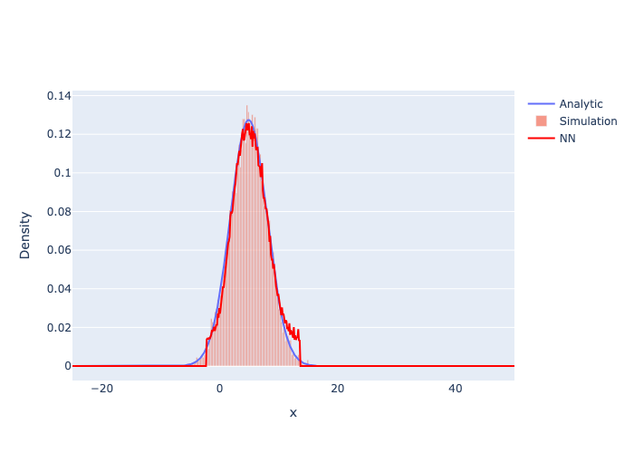
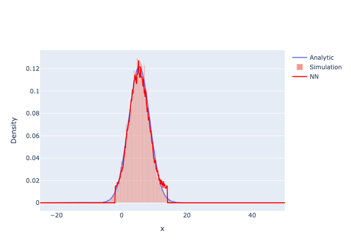
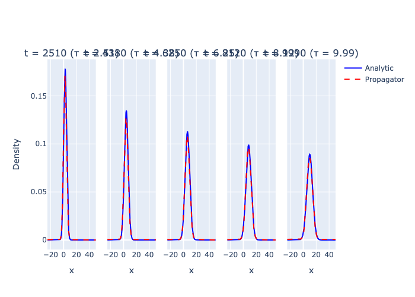

# Physics-Informed Neural Networks (PINN)

[](https://github.com/jvachier/PINN/actions/workflows/ruff.yml)
[](https://www.python.org/)
[](https://github.com/astral-sh/ruff)
[](https://mypy-lang.org/)
[](https://pre-commit.com/)
[](LICENCE)
[](https://isocpp.org/)
[](src/Simulation_Cpp/Dockerfile)

A physics-informed machine learning pipeline for 1D Langevin dynamics.
The C++ simulator generates particle trajectory data; a Python neural network learns
the evolving probability-density function (PDF) and a physics-constrained propagator
predicts the PDF at future times without any further simulation.

> **Scope of "physics-informed":** the physics constraint (Fokker–Planck residual in
> the loss) applies specifically to the propagator model (`nn_model_propagator`).
> The PDF predictor (`nn_model`) is a standard supervised model trained purely on
> simulation and analytic data.

---

## Physics Background

The position $x(t)$ of a particle follows the Langevin equation:

$$\frac{d}{dt}x = v_s + \sqrt{2 D_t} \, \xi(t)$$

where $v_s$ is the drift velocity, $D_t$ is the translational diffusion coefficient, and
$`\langle\tilde{\xi}_{i}(\tilde{t}')\tilde{\xi}_{j}(\tilde{t})\rangle = \delta_{ij}\delta(\tilde{t}'-\tilde{t})`$ is a Gaussian white noise.

The Langevin equation allows us to express the probability of finding a particle at position
$x$ at a given time $t$ through the Fokker–Planck equation, which describes the evolution of
the probability density function $P(x, t \mid x_0, t_0)$, with the initial condition
$P(x, t{=}t_0 \mid x_0, t_0) = \delta(x - x_0)$.
To simplify the notation, we write $P(x, t) = P(x, t \mid x_0, t_0)$ and arrive at:

$$\frac{\partial P}{\partial t} = -v_s \frac{\partial P}{\partial x} +  D_t \frac{\partial^2 P}{\partial x^2}$$

which has the analytic solution:

$$P(x,t) = \frac{1}{\sqrt{4\pi D_t t}} \exp\!\left(-\frac{(x - v_s t)^2}{4 D_t t}\right)$$

---

## Repository Structure

```
PINN/
├── Makefile                        # Top-level build targets
├── src/
│   ├── Simulation_Cpp/             # Langevin dynamics simulator (C++17 / OpenMP)
│   │   ├── code/
│   │   │   ├── LE_1D_confine.cpp   # Main simulation entry point
│   │   │   ├── parameter.txt       # Simulation parameters
│   │   │   ├── Makefile            # C++ build rules
│   │   │   └── headers/            # C++ header files
│   │   ├── data/                   # Simulation output (simulation.bin / .csv)
│   │   └── Dockerfile              # Ubuntu 24.04 image for reproducible builds
│   └── Neural_Network_python/      # Python ML pipeline (TensorFlow / Keras)
│       ├── code/
│       │   ├── main.py             # Orchestration entry point
│       │   ├── settings.toml       # Central configuration (all tunable parameters)
│       │   └── modules/
│       │       ├── data_preparation.py  # Binary → Parquet conversion
│       │       ├── data_analytic.py     # Analytic Fokker–Planck solution
│       │       └── neural_network.py    # NN model, propagator, plotting
│       └── pyproject.toml          # Python project & dependency spec (uv)
```

---

## Quick Start

### Requirements

| Tool | Version |
|------|---------|
| clang++ (macOS) / g++ (Linux) | ≥ 17 |
| OpenMP | via libomp (Homebrew) or libgomp |
| Python | 3.11 |
| uv | ≥ 0.7 |

### 1 — Build and run the C++ simulation

```bash
# Compile (macOS with Homebrew libomp)
make sim-build

# Run — writes src/Simulation_Cpp/data/simulation.bin (~38 MB)
make sim-run
```

### 2 — Install Python dependencies

```bash
cd src/Neural_Network_python
uv sync
```

### 3 — Run the full ML pipeline

```bash
cd src/Neural_Network_python/code
uv run python main.py
```

Figures are written to `code/figures/` as both `.html` (interactive) and `.png` (static).

---

## Configuration

All tunable parameters live in [`src/Neural_Network_python/code/settings.toml`](src/Neural_Network_python/code/settings.toml):

| Section | Key | Description |
|---------|-----|-------------|
| `[analytic]` | `x_min`, `x_max`, `x_step` | Spatial domain for the analytic solution |
| `[network]` | `n_bins` | Histogram bins (coarse NN grid) |
| `[network]` | `train_test_split` | Fraction of time-steps used for training |
| `[training]` | `epochs_nn` | Max epochs for the PDF predictor |
| `[training]` | `epochs_propagator` | Max epochs for the Fokker–Planck propagator |
| `[training]` | `multi_step` | Max prediction-gap (steps) during propagator training |
| `[physics]` | `vs`, `Dt`, `delta`, `timestep` | Physical parameters — keep in sync with `parameter.txt` |
| `[physics]` | `weight` | Fokker–Planck residual weight $\lambda$ |

---

## Docker / Colima (optional)

A `Dockerfile` is provided for the C++ simulator (useful on Linux CI or when
the host compiler is unavailable):

```bash
# Start Colima (macOS) — only needed once per session
make colima-start

# Build Docker image
make docker-build

# Run simulation inside container → writes simulation.bin to the host's data/ dir
make docker-run
```

---

## Project Layout — Machine Learning

```
data_preparation  →  simulation.bin  →  prepdata_from_binary.parquet
data_analytic     →  analytic_data.parquet   (Fokker–Planck Gaussian)
neural_network    →  PDF predictor  (histogram + time → PDF)
                  →  FP propagator  (histogram_t + Δt → histogram_{t+Δt})
rollout           →  autoregressive future PDF prediction
```

---

## Results

All figures are written to `src/Neural_Network_python/code/figures/` as `.png` (static) and `.html` (interactive).

### Figure 1 — PDF Predictor: Training set

The neural network (red) learns to reproduce the analytic Fokker–Planck Gaussian (blue) from
the noisy simulation histogram (orange bars) on the training time-steps.

<figure>
  
  <figcaption><b>Figure 1:</b> PDF predicted by the neural network (red) vs. the analytic
  solution (blue) and simulation histogram (orange) at a representative training time-step.</figcaption>
</figure>

---

### Figure 2 — PDF Predictor: Test set

Generalisation to held-out time-steps unseen during training.

<figure>
  
  <figcaption><b>Figure 2:</b> Same comparison as Figure 1 but on a held-out test time-step,
  confirming that the model generalises beyond the training distribution.</figcaption>
</figure>

---

### Figure 3 — Fokker–Planck Propagator: Autoregressive rollout

The physics-constrained propagator predicts the PDF at five future times purely from the
initial distribution, without any further simulation data. The dashed red curve (Propagator)
tracks the analytic Gaussian (blue) across the full rollout window.

<figure>
  
  <figcaption><b>Figure 3:</b> Autoregressive rollout of the Fokker–Planck propagator (dashed red)
  at five future time snapshots τ ≈ 2.5 → 10, compared to the analytic Gaussian (blue).
  The propagator receives no simulation input beyond the initial histogram.</figcaption>
</figure>

